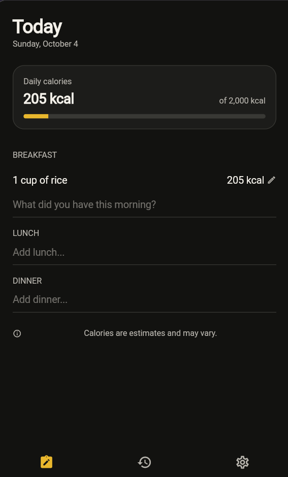

# CALY

[](AI-USAGE.md)

ChatGPT and Codex were used extensively throughout development for planning, explanations, debugging, testing, interface review, and documentation. My individual contributions and the AI-assisted portions are documented in [AI-USAGE.md](AI-USAGE.md).

> Caly is a simple calorie tracking app that makes food logging feel more like writing a normal note. It is designed for people who want to track their calorie intake without using a complicated food logging interface.

**Live demo:** https://kirkdencv.github.io/Caly/

**Demo video:** Not available yet.

**Course:** Applications Development and Emerging Technologies (6ADET), Holy Angel University

This repository is public for the final project. No student number, personal email address, passwords, API keys, or other private information should be committed to this repository.

See `SECURITY-CHECKLIST.md` and `docs/06-security-and-privacy.md` for the current security and privacy documentation.

---

## Screenshots

The current MVP includes Sign In, Today, Food Correction, History, Settings,
three-tab navigation, local persistence, and Gemini-backed food interpretation.

Add the latest development screenshot here after saving it inside `docs/assets/`.

Example:

```md

```

Planned final screenshots will include:

- Sign In
- Today's Food Note
- Food Correction
- Food History
- Settings

---

## What it does

Caly is a working MVP with local journal persistence and a FastAPI/Gemini food
interpretation service. Public hosting is still a separate deployment step.

### Currently working

- Runs as a Flutter web application.
- Uses Device Preview during development and removes it from release builds.
- Uses a custom Caly theme that follows the device's light or dark appearance.
- Uses shared colors, typography, spacing, button styles, and input styles.
- Displays the mockup-aligned Today food journal screen.
- Displays Breakfast, Lunch, and Dinner using a reusable `MealSection` widget.
- Provides a plain, note-like input line inside every meal section.
- Interprets a line automatically after typing pauses, or immediately on Enter.
- Uses separate local `List<FoodEntry>` state for Breakfast, Lunch, and Dinner.
- Sends a typed food note and selected meal to the local FastAPI service.
- Shows moving dots, error, and retry states on only the affected food row.
- Preserves the typed note when a request fails.
- Displays food rows with calories and calculates the live daily total.
- Allows correcting food details, serving units, and calories.
- Supports swipe-to-delete with Undo and recalculates the total immediately.
- Includes local History and Settings screens with working navigation.
- Validates the documented local demo credentials before opening the app.
- Optionally restores the local demo session after an app restart.
- Displays the demo account in Settings and clears its session on sign-out.
- Saves completed daily food entries as JSON on the current device.
- Reloads saved entries by journal date and persists corrected calories.
- Saves and reloads the daily calorie goal.
- Groups saved days in a notes-style History with food summaries and totals.
- Filters saved History locally by food, date, or calorie value.
- Opens a selected saved date in Today and saves edits back to that date.

### In development

- Final testing, screenshots, and demo preparation.

Flutter is connected to FastAPI, which uses Gemini for structured food
interpretation. Journal days, calorie goals, and the demo session now persist
locally with JSON and `shared_preferences`.

---

## Built with

| | |
| --- | --- |
| Framework | Flutter (Dart) |
| Flutter version | 3.44.4 |
| Dart version | 3.12.2 |
| State | Local Flutter state using `StatefulWidget` and `setState()` |
| Storage | `shared_preferences` with validated JSON for daily notes, calorie goal, and the demo session flag |
| Backend | FastAPI with a tested Gemini-backed food interpretation endpoint |
| AI | Gemini structured output, validated by Pydantic before reaching Flutter |
| Other packages | `device_preview` — used to preview the Flutter app at phone size in the browser |

---

## Running it yourself

Make sure Flutter is installed first:

```bash
flutter --version
```

The version currently used to develop Caly is:

```text
Flutter 3.44.4
Dart 3.12.2
```

Clone the repository:

```bash
git clone https://github.com/kirkdencv/Caly.git
cd Caly
```

Install the dependencies:

```bash
flutter pub get
```

Start FastAPI in one terminal:

```powershell
backend\.venv\Scripts\Activate.ps1
python -m uvicorn backend.app.main:app --reload
```

Run the Flutter web application in another terminal:

```bash
flutter run -d web-server --web-port 8080
```

Then open:

```text
http://localhost:8080
```

When it is working, the application should appear inside Device Preview using a phone-sized layout.

Use the local demo credentials:

```text
Email: caly.user@gmail.com
Password: calyuser123
```

This is a deliberately hard-coded demonstration login, not secure
authentication. Do not reuse the demo password for a real account.

---

### Environment variables

Flutter uses `http://127.0.0.1:8000` as its default API base URL. Override it
when needed with a compile-time Dart definition:

```bash
flutter run --dart-define=CALY_API_BASE_URL=http://127.0.0.1:8000
```

Copy `backend/.env.example` to `backend/.env`, then add your Google AI Studio
key to the ignored local file:

```dotenv
GEMINI_API_KEY=your_real_key_here
GEMINI_MODEL=gemini-3.5-flash-lite
GEMINI_TIMEOUT_SECONDS=15
CALY_ALLOWED_ORIGINS=https://your-flutter-site.example
```

Never put the real value in `.env.example` or commit `backend/.env`.

The current MVP architecture is:

```text
Flutter
   |
   | HTTP request
   v
FastAPI
   |
   v
Gemini API

Flutter local storage
   |
   v
shared_preferences + JSON
```

The Gemini API key will stay on the FastAPI server and will not be placed inside the Flutter application.

---

## Privacy and secrets

The current development version stores journal entries, the calorie goal, and
the demo-session flag in local application preferences. This data is not
encrypted secure storage and must not contain sensitive medical information.
Clearing browser or application data can remove it.

The Sign In screen is a local demonstration flow, not secure production
authentication. A future production version would need a real identity service,
server-side authorization, and an appropriate database; those services are not
part of this MVP.

Secrets such as API keys must not be committed to the repository. Local secret files are excluded through `.gitignore`, and server-side secrets will remain on the backend.

The current security review found no real API key or privileged token in the
tracked Flutter files and no tracked keystore or signing credential. The demo
email and password are intentionally hardcoded and recoverable from the web
bundle, so they must never protect private data. Git history searches found no
real Gemini credential.

All sample data, screenshots, and the final demo should contain no real passwords, API keys, student numbers, personal email addresses, or other private information.

---

## Project structure

Current important Flutter files:

```text
lib/
├── main.dart
├── models/
│   ├── daily_note.dart
│   ├── food_entry.dart
│   └── meal_category.dart
├── screens/
│   ├── today_screen.dart
│   ├── history_screen.dart
│   ├── settings_screen.dart
│   └── sign_in_screen.dart
├── services/
│   ├── food_api_service.dart
│   ├── local_demo_auth_service.dart
│   └── local_storage_service.dart
├── theme/
│   ├── caly_theme.dart
│   └── caly_spacing.dart
├── utils/
│   └── formatters.dart
└── widgets/
    ├── caly_brand_header.dart
    ├── caly_page_body.dart
    ├── daily_calorie_summary.dart
    ├── food_correction_sheet.dart
    ├── large_title_header.dart
    └── meal_section.dart
```

### `lib/main.dart`

Starts the Flutter application, restores the optional local session, configures
debug-only Device Preview, creates `MaterialApp`, and selects the current home
screen.

### `lib/theme/caly_theme.dart`

Contains Caly's color scheme, typography, button styling, input styling, and other shared theme settings.

### `lib/theme/caly_spacing.dart`

Contains the shared spacing scale used by the interface: `xs`, `sm`, `md`, `lg`, and `xl`.

### `lib/screens/today_screen.dart`

Coordinates the Today journal, one lifecycle state object per meal,
asynchronous food submission, retry handling, persistence, and historical-day
selection. Focused widgets own the calorie summary and correction form.

### `lib/screens/history_screen.dart`

Loads all saved `DailyNote` objects, sorts and searches them locally, and sends
the selected journal date back to the app shell.

### `lib/services/food_api_service.dart`

Encodes food notes as JSON, calls FastAPI, validates the response through
`FoodEntry.fromJson`, and converts network, timeout, and response failures into
messages the row can display.

### `lib/services/local_storage_service.dart`

Stores validated daily-note JSON, the calorie goal, and the demo-session flag
with `shared_preferences`.

### `lib/widgets/meal_section.dart`

Stateless reusable widget for Breakfast, Lunch, and Dinner. It receives the meal
name, entries, and action callbacks from `TodayScreen`.

---

## Project documentation

| Document | |
| --- | --- |
| [Proposal](docs/01-proposal.md) | the problem, users, scope, and planned architecture |
| [Mockup and wireframes](docs/02-mockup.md) | the planned screens and user flow |
| [Design system](docs/03-design-system.md) | Caly's colors, typography, spacing, and components |
| [Weekly reports](docs/04-weekly-reports.md) | development progress for each week |
| [Demo video](docs/05-demo-video.md) | the final recording and what it demonstrates |
| [Security and privacy](docs/06-security-and-privacy.md) | privacy and security documentation |
| [Security checklist](SECURITY-CHECKLIST.md) | security checks and current evidence |
| [AI usage](AI-USAGE.md) | the record of AI assistance during development |
| [Contributing](CONTRIBUTING.md) | commit naming, testing, and repository hygiene |

---

## Development timeline

| Date | Recorded milestone |
| --- | --- |
| 2026-09-27 | Added local Breakfast state and updated project documentation. |
| 2026-09-28 | Changed the planned MVP from Firebase to local JSON persistence and a demo login. |
| 2026-09-29 | Connected the Flutter, FastAPI, Gemini, storage, History, Settings, and login phases. |
| 2026-09-30 | Debugged backend failures and prepared service and widget regression tests. |
| 2026-10-01 | Published the integrated Caly MVP through pull request 3. |
| 2026-10-02 | Split follow-up work into focused backend, Today, visual-system, History, test, and documentation commits. |

The activity dates above describe when development and review happened. Some
multi-day work was recorded by a later integration commit. Public commit dates
and merged pull-request history are intentionally preserved rather than
backdated. See [AI-USAGE.md](AI-USAGE.md) for the detailed record.

---

## Status and what is next

### Working

- Flutter project runs successfully.
- Dependencies install successfully using `flutter pub get`.
- Device Preview works.
- The Caly color scheme and typography are connected to the application.
- Shared spacing values are available through `caly_spacing.dart`.
- Shared `FilledButton` and input styling are prepared.
- The Today screen has been created.
- Breakfast, Lunch, and Dinner use the reusable `MealSection` widget.
- `MealSection` reports inline note changes and submissions to `TodayScreen`.
- `TodayScreen` uses local state with `setState()`.
- Breakfast, Lunch, and Dinner have separate `List<FoodEntry>` state.
- Pausing after a typed food line sends its text and selected meal to FastAPI.
- The interpreted response is added to the correct meal and updates the total.
- Moving-dot, backend error, and retry states are scoped to the affected row.
- Corrections update the selected row and daily total.
- Sign In, History, Settings, and bottom navigation match the high-level mockup.
- Empty login fields and invalid demo credentials show clear errors.
- Successful demo login stores a local session flag and can be restored.
- Settings shows the demo email and sign-out clears the session.
- `FoodEntry` and `DailyNote` support validated local serialization.
- Successful additions and corrections update the saved journal day.
- Local storage can load, update, list, and delete saved days.
- The calorie goal persists and updates both Settings and Today.
- History renders locally saved notes in descending date order.
- History search filters the loaded notes without additional storage reads.
- Selecting History opens that date in Today; corrections remain date-scoped.
- FastAPI runs locally and exposes `POST /api/v1/foods/interpret`.
- Pydantic validates the food request and response contract.
- Gemini receives only the food text, may ground nutrition data with Google
  Search, and returns structured food fields.
- FastAPI retains control of `originalText` and `mealCategory`.
- Pydantic cleans numeric strings and rejects invalid quantities or calories.
- Independent backend tests cover success, validation, timeouts, API failures,
  invalid model output, and configuration failures.
- Today displays a compact calorie-goal summary near the top.
- Food rows support swipe-to-delete with an Undo action.
- History groups saved notes into Recent, Previous 7 Days, and Older.
- Caly follows the device's light or dark appearance.

### Not implemented yet

- Secure production authentication behind the demo Sign In interface
- Cloud synchronization across devices
- Final screenshots
- Demo video

### Next development step

The next development step is final behavior testing and demo preparation.
Secure production authentication can replace `LocalDemoAuthService` later.

Commit messages follow the Conventional Commits rules documented in
[CONTRIBUTING.md](CONTRIBUTING.md). Existing public commits and pull requests
are preserved rather than backdated or rewritten.

---

## Credits

- Flutter and Dart
- `device_preview` package
- Other packages will be added here when they are actually used.
- Any external assets, icons, images, or other resources will be credited here with their source and licence.

---

## Licence

MIT, see [LICENSE](LICENSE).
