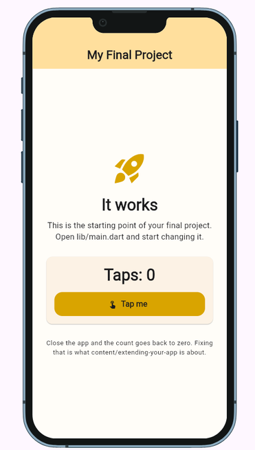
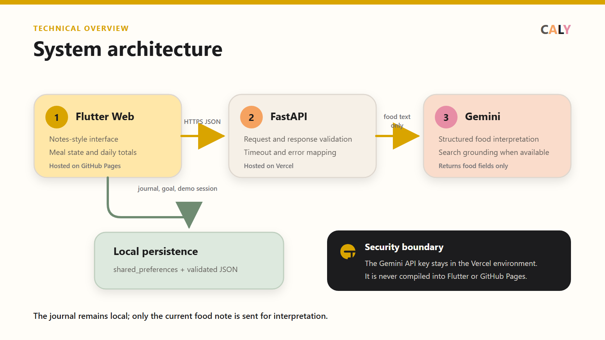
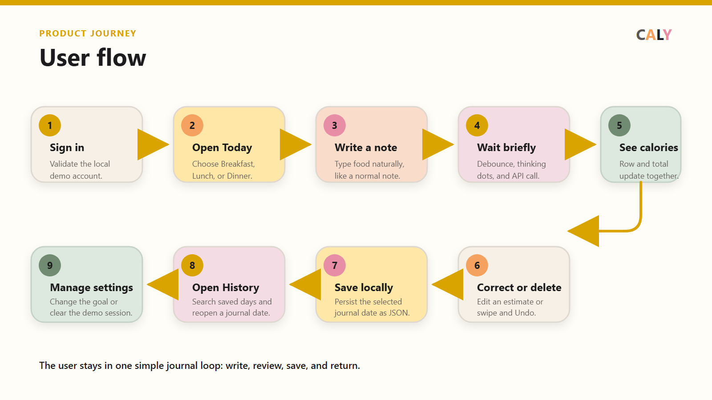
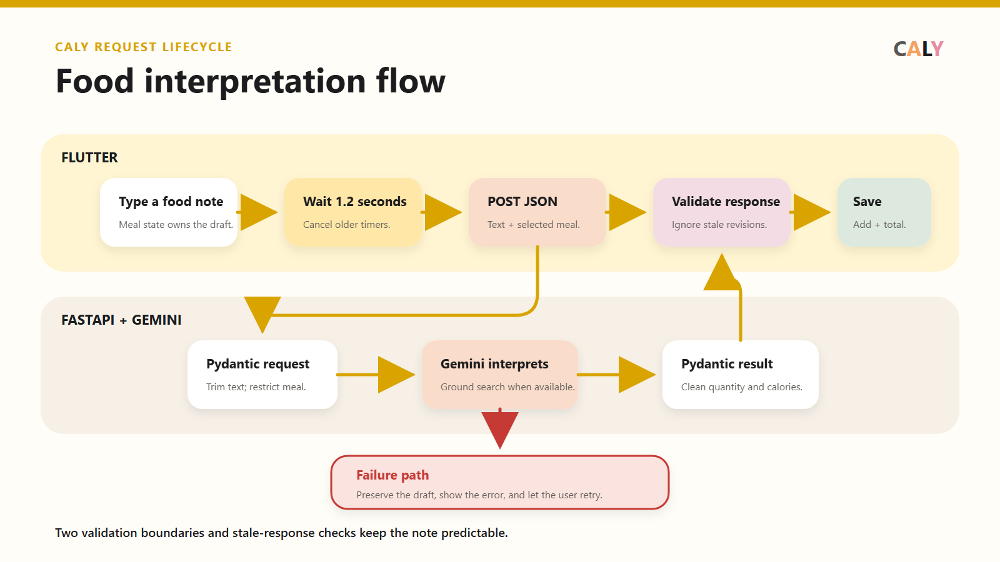

# Caly

[](AI-USAGE.md)

Caly is my Flutter project, created and maintained by
[@kirkdencv](https://github.com/kirkdencv). It is a note-style calorie journal
for people who want to record food naturally without working through a complex
nutrition-tracking interface.

## Repository

- **Project author:** [@kirkdencv](https://github.com/kirkdencv)
- **Public repository:** [Caly on GitHub](https://github.com/kirkdencv/Caly)
- **Live app:** [Caly on GitHub Pages](https://kirkdencv.github.io/Caly/)
- **Demo video:** [Caly project presentation](https://tinyurl.com/CalyPresentation)

## 1. Overview

Caly is a working Flutter web MVP for writing Breakfast, Lunch, and Dinner as
short food notes. After typing stops, the app sends the note to a FastAPI
backend. Gemini interprets the food name, quantity, unit, and estimated
calories, while FastAPI validates the result before returning it to Flutter.

Journal entries, calorie goals, and the optional demo-login session are stored
locally with `shared_preferences` and JSON. Saved days can be searched in
History and reopened for correction or deletion. Caly follows the browser or
device light/dark preference.

The public web app is hosted on GitHub Pages. Its FastAPI service is deployed
separately on Vercel so the Gemini API key stays on the server and is never
compiled into the Flutter web bundle.

## 2. Setup and installation

The project was built with Flutter 3.44.4 and Dart 3.12.2. The backend requires
Python and a Google AI Studio Gemini API key.

Clone the repository and fetch the Flutter packages:

```bash
git clone https://github.com/kirkdencv/Caly.git
cd Caly
flutter pub get
```

Create the backend environment from Git Bash:

```bash
python -m venv backend/.venv
source backend/.venv/Scripts/activate
python -m pip install -r backend/requirements.txt
cp backend/.env.example backend/.env
```

Open `backend/.env` and replace only the local placeholder:

```dotenv
GEMINI_API_KEY=replace_with_your_google_ai_studio_key
GEMINI_MODEL=gemini-3.5-flash-lite
GEMINI_TIMEOUT_SECONDS=15
CALY_ALLOWED_ORIGINS=https://kirkdencv.github.io
```

`backend/.env` is ignored by Git. Never add a real Gemini key to Flutter,
`.env.example`, a workflow file, or a commit.

## 3. How to run it

Start FastAPI from the repository root in the first Git Bash terminal:

```bash
source backend/.venv/Scripts/activate
python -m uvicorn backend.app.main:app --reload
```

Confirm the backend is available:

- Health check: <http://127.0.0.1:8000/health>
- Interactive API documentation: <http://127.0.0.1:8000/docs>

In a second Git Bash terminal, run Flutter in Chrome:

```bash
flutter run -d chrome \
  --dart-define=CALY_API_BASE_URL=http://127.0.0.1:8000
```

The sign-in screen uses a local demonstration account:

```text
Email: caly.user@gmail.com
Password: calyuser123
```

This is intentionally a demo login, not secure authentication. It does not
protect private or server-side user data.

Run the automated checks with:

```bash
flutter analyze
flutter test
python -m pytest backend/tests
```

The backend tests use fake clients and do not call Gemini or consume API quota.

## 4. Features and usage

- **Sign in:** Enter the documented demo credentials. A successful sign-in can
  be restored locally after a browser refresh. Invalid or empty credentials
  remain on the sign-in screen with an error.
- **Today:** Type food or a drink on a line under Breakfast, Lunch, or Dinner.
  Caly waits until typing pauses before submitting, so incomplete words are not
  interpreted prematurely. Pressing Enter submits immediately.
- **Food interpretation:** Moving dots appear only on the affected line while
  FastAPI and Gemini calculate an estimate. The completed row displays the food
  and calories. Failed requests preserve the typed text and can be retried.
- **Correction and deletion:** Open an interpreted row to correct its food
  details or calories. Swipe a row to delete it; Undo restores it. Every change
  recalculates and saves the daily total.
- **History:** Browse fictional seeded demo days and saved journal days, grouped
  into Recent, Previous 7 Days, and Older. Search locally by food, date, or
  calorie value, then open a day to edit it in Today.
- **Settings:** Change the daily calorie goal, view the demo account, follow the
  system appearance, or sign out. Goal and session changes persist locally.

### Calorie interpretation states

| State | What the user sees | Meaning |
| --- | --- | --- |
| Typing | Plain note text | Caly is waiting for a pause or Enter. |
| Loading | Animated dots | The selected line is being interpreted. |
| Success | Food name and calories | FastAPI returned a validated result. |
| Error | Message and retry action | The note is preserved and can be retried. |

### Storage behavior

Caly stores daily notes under date-based keys in local application preferences.
Each `DailyNote` contains its date, food entries, total calories, and timestamps.
The calorie goal and demo-session flag use separate preference keys. This data
belongs only to the current browser or device; clearing site/app data removes
it, and it does not synchronize between devices.

### API behavior

Flutter sends only the typed note and selected meal to
`POST /api/v1/foods/interpret`. Gemini receives the food text, while FastAPI
keeps control of `originalText` and `mealCategory`. Pydantic validates the
structured quantity and calorie values before Flutter receives them.

The backend can use Gemini Google Search grounding for current branded or
restaurant nutrition information. If search quota is unavailable, it retries
without grounding and returns the best validated estimate it can produce.

## 5. Project structure

```text
assets/
  diagrams/                 System architecture and user-flow PNGs
  images/                   Caly mascot
backend/
  app/
    routes/                 FastAPI food endpoint
    services/               Gemini interpretation service
    config.py               Environment and CORS configuration
    main.py                 FastAPI application and health check
    schemas.py              Pydantic request and response validation
  tests/                    Backend configuration, route, and service tests
  index.py                  Vercel FastAPI entry point
  vercel.json               Vercel framework configuration
docs/
  01-proposal.md            Problem, users, scope, and architecture
  02-mockup.md              Screen plan and user flow
  03-design-system.md       Colors, typography, spacing, and components
  04-weekly-reports.md      Development progress
  05-demo-video.md          Video link and timestamps
  06-security-and-privacy.md Security and privacy review
lib/
  data/                     Fictional demo-history seed
  models/                   FoodEntry, DailyNote, and meal categories
  screens/                  Sign In, Today, History, Settings, and app shell
  services/                 API, local storage, and demo-auth services
  theme/                    Light/dark themes and spacing
  widgets/                  Shared journal and brand widgets
test/                       Flutter service, storage, screen, and flow tests
.github/workflows/          GitHub Pages build and deployment
AI-USAGE.md                 AI assistance disclosure and commit evidence
CONTRIBUTING.md             Commit, testing, and repository conventions
README.md                   Setup, usage, project map, and limitations
```

## 6. Screenshots and diagrams

### Application preview



### Square project image


### System architecture



### User flow



### Food interpretation flow



## 7. Known issues and next steps

- The local demo login is visible in the source and web bundle. It must not be
  treated as production authentication.
- Journal data is local to one browser or device and can be lost when its data
  is cleared. Cloud synchronization is not implemented.
- Calorie values are AI-generated estimates and are not medical or dietary
  advice. Portions and restaurant recipes can differ from the estimate.
- New food interpretation needs network access, the deployed FastAPI service,
  Gemini availability, and remaining API quota. Previously saved notes remain
  local.
- The public food endpoint does not yet have user authentication or per-user
  rate limiting. Production use would require both before serving paid traffic.
- Automated tests cover the main journal, storage, login, and API paths, but
  broader browser and physical-device testing is still useful.

Planned next steps are secure authentication, authenticated rate limiting,
cloud synchronization, stronger accessibility testing, and more device/browser
coverage.

## Presentation

- **Video:** [Public Caly presentation](https://tinyurl.com/CalyPresentation)
- **Detailed timestamps:** [Demo video notes](docs/05-demo-video.md)
- **Live demonstration:** [Caly on GitHub Pages](https://kirkdencv.github.io/Caly/)
- **Square image:** [Caly project image](assets/images/caly-square-image.jpg)
- **Project visuals:** [Architecture and flow diagrams](assets/diagrams/)

## Authorship and AI usage

This is my Flutter final project. I designed the Caly concept and worked on the
note-style Today flow, reusable meal interface, theming, History organization,
Gemini-backed calorie handling, and regression tests.

ChatGPT and OpenAI Codex were used extensively for planning, explanations,
debugging, testing, interface review, deployment, and documentation. The
self-authored work documented in the project covers more than 20% of the final
implementation. The exact AI-assisted tasks, mistakes I caught, personal
contributions, explanations, and supporting commit links are recorded in
[AI-USAGE.md](AI-USAGE.md).

## Security and privacy

See [Security and privacy](docs/06-security-and-privacy.md) for the current
review. Real API keys belong only in ignored local environment files or Vercel
environment variables. The Flutter build contains only the public backend URL.

Do not enter private medical information into the public demonstration. All
seeded journal entries are fictional.

## Licence

MIT. See [LICENSE](LICENSE).
